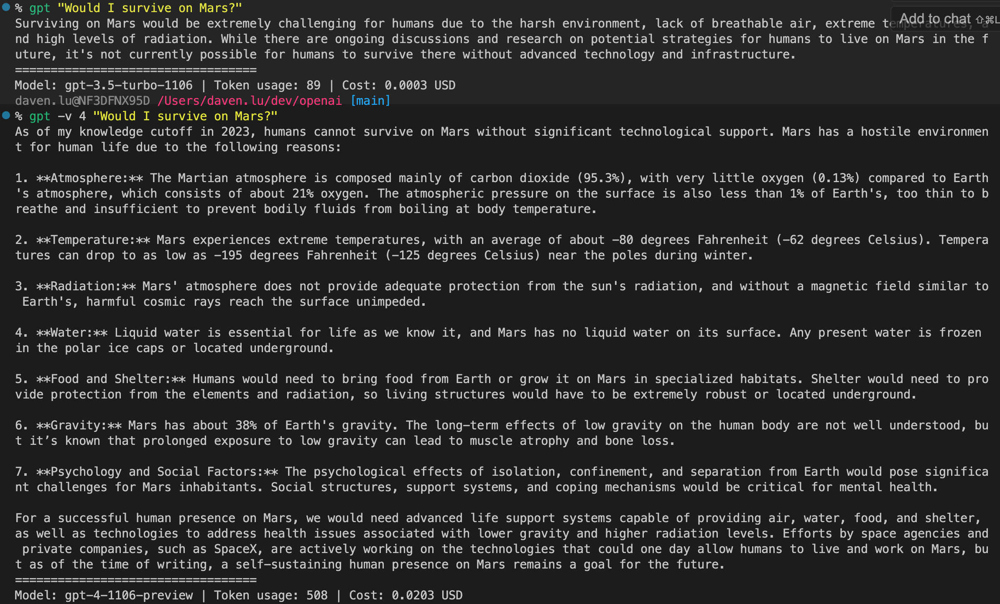

# Welcome to my Github. I'm Dave.

I'm a Canadian developer based in Japan with 4 years of experience in software development and cloud architecture. I'm a Japanese/English bilingual.

I love economics, financial markets, and tech. My resume is [here](#resume)

# Navigation

-   [Contact](#contact)
-   [Work-history](#work-history)
    -   [Software Engineer - Slalom (April 2023 - Present)](#software-engineer---slalom--april-2023---present-)
    -   [Software Engineer - Innovature Technologies (June 2022 - April 2023)](#software-engineer---innovature-technologies--june-2022---april-2023-)
    -   [System Engineer - Triplet R&D (August 2021 - June 2022)](#system-engineer---triplet-r-d--august-2021---june-2022-)
    -   [Full Stack Software Engineer - Solacom (Long Term Intern) (March 2021 - August 2021 - 6 months)](#full-stack-software-engineer---solacom--long-term-intern---march-2021---august-2021---6-months-)
-   [Code Samples](#code-samples)
-   [Education](#education)
-   [Resume](#resume)
-   [Certifications](#certifications)

## Contact

Phone: 080-7857-four-zero-seven-zero  
Email (preferred method of contact): davenlu1989 (at) gmail (dot) com  
Location: Tokyo, Japan  
Facebook: https://www.facebook.com/daven.lu  
LinkedIn: https://linkedin.com/in/davenlu  
Twitter: https://twitter.com/msoup10

## Work-history

### Software Engineer - Slalom (April 2023 - Present)

-   Currently working on a generativeAI project to aid consultants in creating presentation decks
-   Developed and showcased an AI digital human at Google Next 2023 to increase company visibility and employee capabilities. The event got thousands of project managers, engineers, and business leaders to demonstrate the capabilities of the Google Cloud Platform. This AI was created by leveraging the Google Cloud Platform--serverless cloud functions behind an API Gateway. I contributed to the backend logic and created Terraform modules so that the project could be deployed anywhere.
-   Architected and provisioned infrastructure to support a highly available web application in AWS, and allowed repeatable deployments through Terraform
-   Produced a total cost of ownership estimate for the proposed solution
-   Provisioned infrastructure to support a three-tier web application and deployed to AWS
-   Developed a serverless full-stack application using React, API Gateway, Lambda, Cognito and DynamoDB
-   Architected and provisioned CI/CD pipeline to automate deployment of code using Jenkins and AWS developer tooling

### Software Engineer - Innovature Technologies (June 2022 - April 2023)

Led a team of engineers on a SaaS product that drives the advertising of numerous world-renowned companies.

-   Developed dashboards for a cosplay live-streaming application to track transactions within the web app (Angular, TypeScript, MySQL).
-   In a SaaS web application, as the number of users grew, a database deadlock issue began slowing down the performance of the application. I presented the solution of using a simple and managed queue driver (Amazon SQS) and helped build out the architecture.
-   Saved the client several thousands of dollars a month by switching unused servers to EC2 on-demand instances, reducing the amount of backups we took from 24 to 12.

-   Tech Stack: VueJS, AWS (EC2, ALB, RDS, Redis, Cloudformation)

### System Engineer - Triplet R&D (August 2021 - June 2022)

-   Built dashboards for automotive companies and led the initiative to revamp legacy parts monitoring applications.
-   Increased web application performance by 30% by porting over a legacy codebase responsible for analyzing sensors to detect faulty equipment, patching issues with redundant database writes
-   Solved a race condition problem where fault detectors didn’t trigger when they should have and saved tens of thousands of dollars of lost productivity
-   Bridge Engineer / PM work experience: Oversaw the development of a video streaming app. Dockerized and deployed the app for the client.
-   Established a set of best practices for version control by suggesting better naming conventions and incorporating Github Actions scripts to check builds, resulting in a significantly enhanced workflow
-   Tech Stack: Javascript, Python (Django Rest Framework)

### Full Stack Software Engineer - Solacom (Long Term Intern) (March 2021 - August 2021 - 6 months)

Solacom wanted to expand its headquarters in America and Hong Kong, so I created a modern English-facing website during my time there.

-   Mentored interns with the creation of a social distance detector using openCV (Python image detection library)
-   Tech Stack: React, GatsbyJS, NextJS

## Code Samples

### [Text-to-Speech Serverless API Tool](https://github.com/MSoup/openai-tts-api)

-   Auto deploy and manage infrastructure state with Terraform
-   Deploys API Gateway with Lambda proxy integration, an S3 bucket, and configures all environment variables in a secure way
-   Wraps openAI api TTS functionality
-   Locally develop with SAM and Terraform (hybrid approach released by AWS in 2023)
-   Project ready for deployment and use for anyone with an AWS/openAI account

### [OpenAI API GPT CLI](https://github.com/MSoup/cli-assistant)

- automatically installs in a way that does not pollute .zshrc/.bashrc
- ask GPT3.5 questions with `prompt "text_here"`
-   Written in Python, automation scripts aid the alias shortcut
-  `-v` flag to enable GPT4-turbo when higher accuracy is needed
    

### Web Automation CICD Pipeline

-   Code sample [here](https://github.com/MSoup/discord-market-publish)
-   A tool that integrates Github actions for a two-part system:

1. Screenshots various financial instruments from investing.com via Playwright scripts
   

2. [Embeds them into discord](https://github.com/MSoup/discord-market-publish/blob/main/assets/example_discord_embed.png?raw=true) via webhooks

## Education

University of Waterloo
Bachelor of Arts, Economics, Waterloo, Ontario, Canada

_September 2008 - May 2013_

Ritsumeikan Asia Pacific University(立命館アジア太平洋大学)
Oita, Japan

_April 2012 - August 2012 - 1 semester_

## Resume

Updated as of December 2023
Get [here](https://drive.google.com/file/d/1dH29nw4pWCrlAA_33Ls3GvDFavoHPUmN/view?usp=sharing)

## Certifications

-   Japanese Language Proficiency Test (JLPT) N1 Certification
-   Amazon Web Services (AWS) Solutions Architect Associate
-   Azure AZ900 Cloud Fundamentals
-   Amazon Web Services (AWS) Certified Cloud Practitioner
-   MITx 6.00.1 - Introduction to Computer Science and Programming Using Python
-   MITx 6.00.2 - Introduction to Computational Thinking and Data Science
-   Gengo Pro Level Translator
-   TEFL 120H
